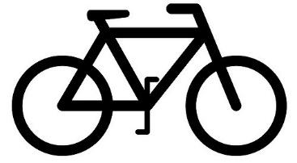

<div id="top"></div>

<br />
<div align="center">
  <a href="https://github.com/Deano7496/BeSpoked-Bikes">
    
  </a>

  <h3 align="center">BeSpoked Bikes</h3>

  <p align="center">
    A basic sales tracking application
    <br />
    <a href="https://github.com/Deano7496/BeSpoked-Bikes/blob/main/README.md"><strong>Explore the docs »</strong></a>
    <br />
    <br />
    ·
    <a href="https://github.com/Deano7496/BeSpoked-Bikes/issues">Report Bug</a>
    ·
    <a href="https://github.com/Deano7496/BeSpoked-Bikes/issues">Request Feature</a>
  </p>
</div>


<details>
  <summary>Table of Contents</summary>
  <ol>
    <li>
      <a href="#about-the-project">About The Project</a>
      <ul>
        <li><a href="#built-with">Built With</a></li>
      </ul>
    </li>
    <li>
      <a href="#getting-started">Getting Started</a>
      <ul>
        <li><a href="#prerequisites">Prerequisites</a></li>
        <li><a href="#installation">Installation</a></li>
      </ul>
    </li>
    <li><a href="#usage">Usage</a></li>
    <li><a href="#roadmap">Roadmap</a></li>
    <li><a href="#contributing">Contributing</a></li>
    <li><a href="#license">License</a></li>
    <li><a href="#contact">Contact</a></li>
  </ol>
</details>


## About The Project

BeSpoked Bikes is a simple, easy to use sales tracking application. It is a full-stack application built with the PERN stack. 

PostgreSQL is a powerful, open source object-relational database system that uses and extends the SQL language combined with many features that safely store and scale the most complicated data workloads.

Express, is a back end web application framework for Node. js, released as free and open-source software under the MIT License. It is designed for building web applications and APIs. 

Node.js is a free and open source cross-platform for server-side programming that allows users to build network applications quickly.

React is a declarative, efficient, and flexible JavaScript library for building user interfaces. It lets you compose complex UIs from small and isolated pieces of code called “components”.

Bootstrap 5 was used to for certain components to give the application a functional simple look.

Although the project is completed, there is still plenty of room for improvement. As a developer you should always strive to improve on everything you do!

<p align="right">(<a href="#top">back to top</a>)</p>


### Built With

* [PostgreSQL](https://www.postgresql.org)
* [Express.js](https://expressjs.com/)
* [Node.js](https://nodejs.org/en/)
* [React.js](https://reactjs.org/)
* [Bootstrap](https://getbootstrap.com)


<p align="right">(<a href="#top">back to top</a>)</p>


## Getting Started

### Prerequisites

This is an example of how to list things you need to use the software and how to install them.
* npm
  ```sh
  npm install npm@latest -g
  ```

### Installation

1. Get a free API Key at [http://heroku.com/](http://heroku.com/)
2. Clone the repo
   ```sh
   git clone https://github.com/Deano7496/BeSpoked-Bikes.git
   ```
3. Install NPM packages
   ```sh
   npm install
   ```
4. Enter your Postgres info in `database.js`
   ```js
   user: "Your Postgres user name",
    host: "Your Postgres host",
    database: "Your postgres database",
    password: "Your Postgres password",
    port: 'Your port'
   ```
5. Alternatively you could use PROCESS.ENV, whichever you prefer.

6. Make sure all table names in postgres match the queries in the project, or change it to tailor your database.
7. Install all appropriate dependencies, including adding certain bootstrap code in the 'public/html' file in src.
8. npm start your front-end in the view directory
9. 'node index.js' when in the initial directory, to get the server running
10. I used 'nodemon' to constantly restart and run server on every change in code, this saves you time constantly going to terminal and restarting the server

<p align="right">(<a href="#top">back to top</a>)</p>


## Usage

This project is best used for clients who want to keep track of all their data in one database.


<p align="right">(<a href="#top">back to top</a>)</p>


## Roadmap

- [x] Add CSS
- [x] Complete Sales Report page
- [x] Implement all features requested
- [/] Create a filter to filter date by range
- [ ] Fix bug when trying to add duplicate data
- [ ] Improve CSS tailored to client
- [ ] Add a login authentication system
    - [ ] Client login
    - [ ] Guest login
- [ ] Improve SQL queries
- [ ] Implement mobile friendly UI, for eg. (hamburger-menu)

See the [open issues](https://github.com/Deano7496/BeSpoked-Bikes/issues) for a full list of proposed features (and known issues).

<p align="right">(<a href="#top">back to top</a>)</p>


## Contributing

Contributions are what make the open source community such an amazing place to learn, inspire, and create. Any contributions you make are **greatly appreciated**.

If you have a suggestion that would make this better, please fork the repo and create a pull request. You can also simply open an issue with the tag "enhancement".
Don't forget to give the project a star! Thanks again!

1. Fork the Project
2. Create your Feature Branch (`git checkout -b feature/AmazingFeature`)
3. Commit your Changes (`git commit -m 'Add some AmazingFeature'`)
4. Push to the Branch (`git push origin feature/AmazingFeature`)
5. Open a Pull Request

<p align="right">(<a href="#top">back to top</a>)</p>


## License

Distributed under the MIT License. See `LICENSE.txt` for more information.

<p align="right">(<a href="#top">back to top</a>)</p>


## Contact

Dean Foster - [dean7496@gmail.com](dean7496@gmail.com) - dean7496@gmail.com

Project Link: [https://github.com/Deano7496/BeSpoked-Bikes](https://github.com/Deano7496/BeSpoked-Bikes)

<p align="right">(<a href="#top">back to top</a>)</p>
